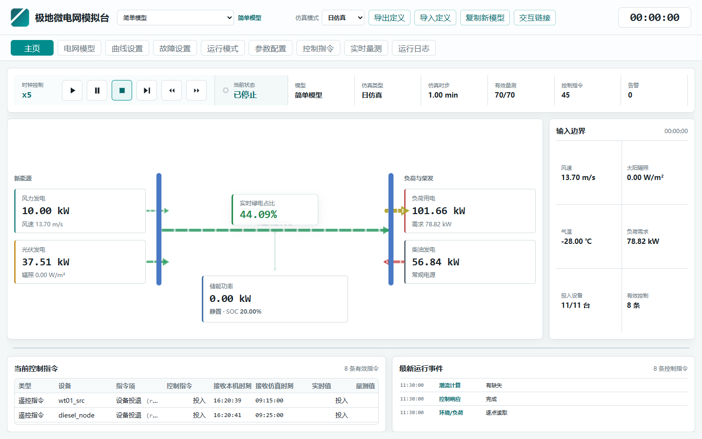
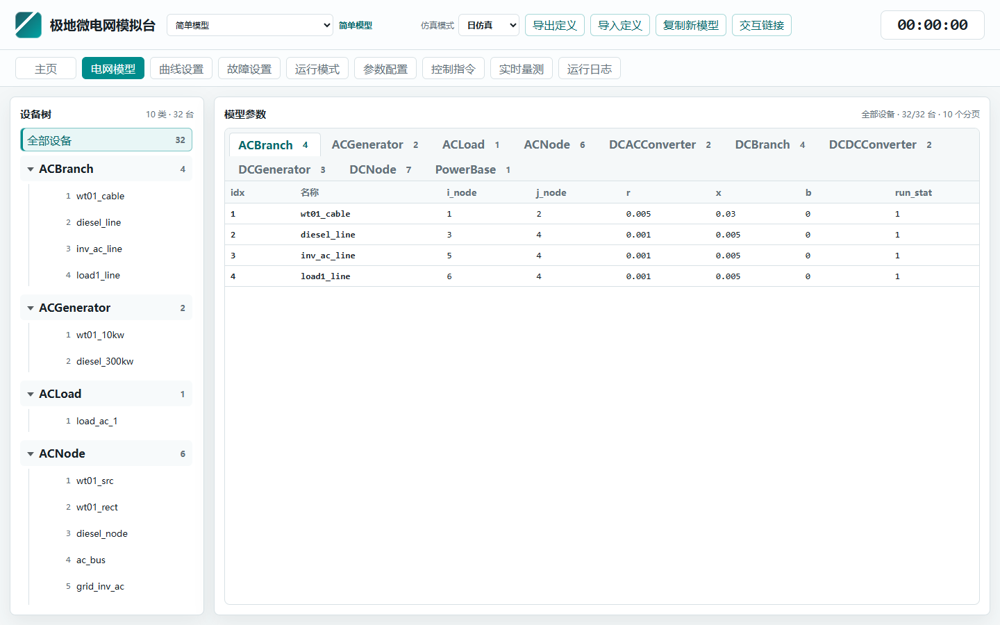
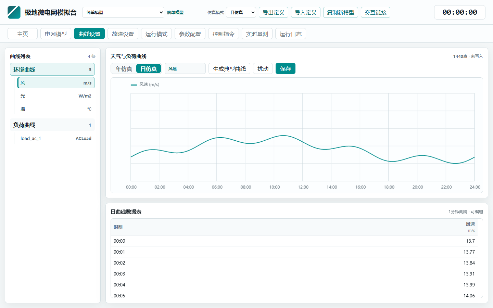
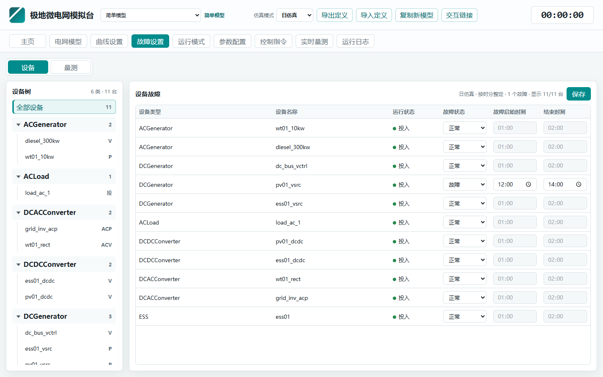
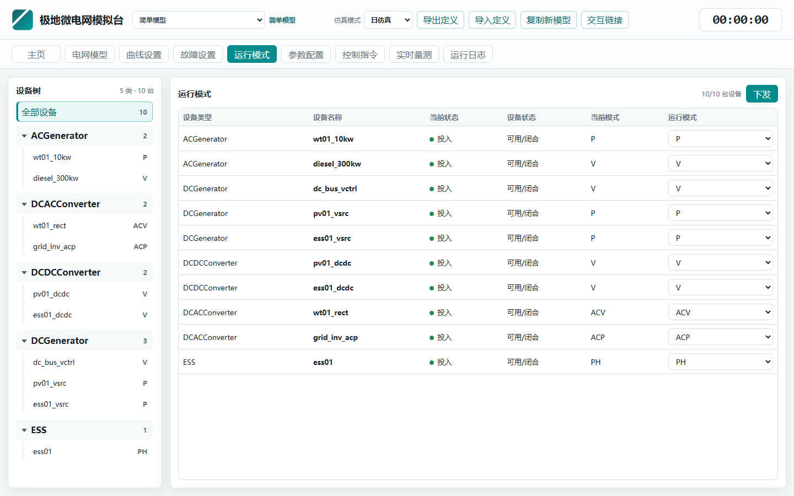
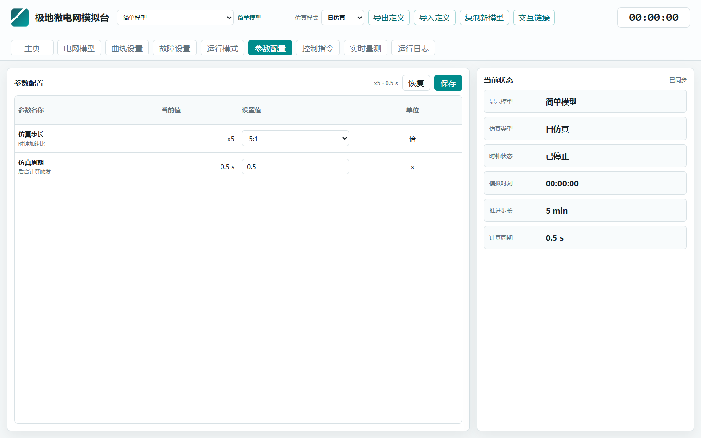
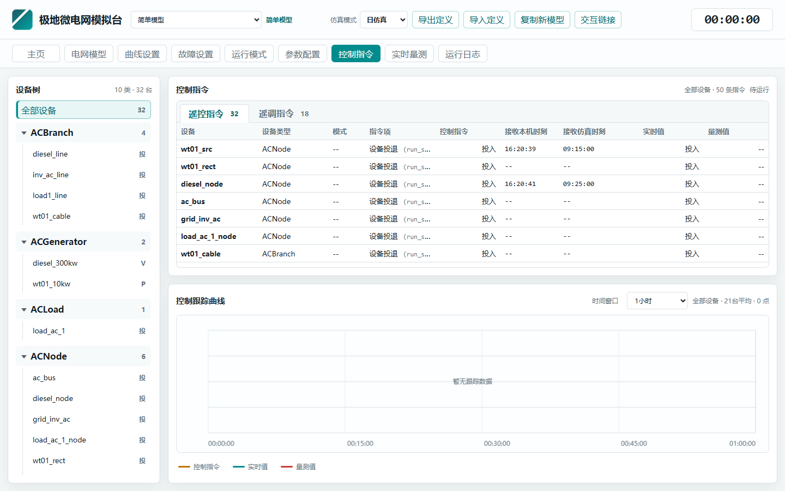
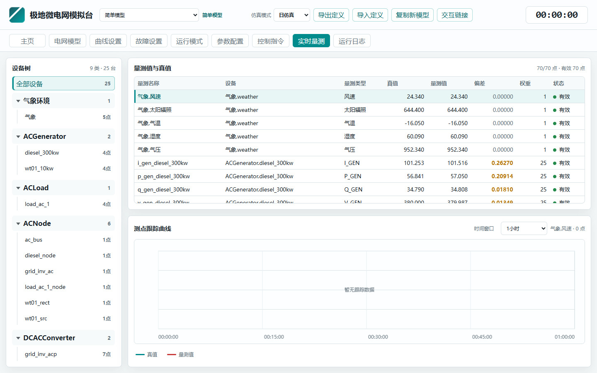
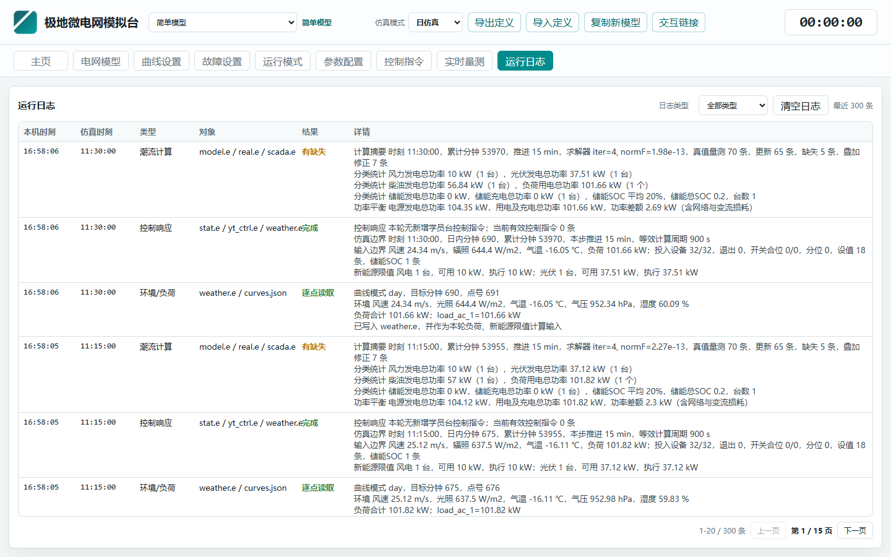

# 极地微电网模拟台使用说明书

人机功能、潮流算法、WEB接口说明及典型用例

版本：v1.0  日期：2026-07-26

## 1. 总体说明与部署

### 1.1 文档范围与阅读方式

本说明书面向模拟台使用、运维和二次开发，覆盖人机功能、潮流算法、WEB 接口和端到端用例。
- 人机功能章节说明页面入口、操作顺序、数据含义和推荐使用路径。
- 潮流算法章节说明输入边界如何进入 model.e，如何生成 real.e 与 scada.e。
- WEB 接口章节说明 REST API 路径、参数、返回结构和可复制示例。
- 用例章节覆盖启动仿真、读取量测、下发控制和取消指令。

### 1.2 系统角色与总体架构

系统分为模拟台和学员台。模拟台是仿真数据源和计算内核入口；学员台是训练操作端。
- 模拟台负责模型管理、工况设置、时钟推进、潮流计算、量测生成和对外接口。
- 学员台负责接收模拟台数据、展示状态、人工或自动下发遥控/遥调指令。
- 外部 EMS/AGC/优化程序可通过模拟台 REST API 获取四遥数据并下发控制。
- 一个模拟台交互链接可以供多个学员台同时接入。

### 1.3 目录结构与模型文件约定

推荐结构为 models/simulator/source 和 models/simulator/runtime。source 保存定义，runtime 保存运行产物。

### 1.4 启动、停止与服务端口

模拟台 WEB 服务由 Python HTTP 服务提供。默认模拟台端口 8710，学员台端口 8720。
- --role simulator 加载模拟台页面和模拟台模型源目录。
- --role trainee 加载学员台页面和学员台模型源目录。
- --compute-interval-seconds 控制后台多久尝试推进一次仿真步，默认 1 秒。
- 建议 Python 调用使用 -X utf8，避免 PowerShell/BOM 相关编码问题。

```powershell
D:\anaconda3\python.exe -X utf8 -m simu.server --role simulator --host 127.0.0.1 --port 8710 --sim-dir D:\codex\power_simu_web --compute-interval-seconds 1
D:\anaconda3\python.exe -X utf8 -m simu.server --role trainee   --host 127.0.0.1 --port 8720 --sim-dir D:\codex\power_simu_web --compute-interval-seconds 1
```

## 2. 模拟台人机功能

### 2.1 模拟台主页：状态、能流与当前指令

#### 界面截图



图 2-1 模拟台主页：时钟控制、能量流和当前有效指令

主页用于快速观察当前仿真状态、输入边界、电气能量流、当前有效控制指令和最新运行事件。
- 电气能量流左侧为新能源，中间为储能，右侧为负荷和柴油发电。
- 实时绿电占比按照 (1 - 柴发功率/负荷功率) * 100% 计算。
- 流动箭头表达潮流方向，箭头大小表达功率大小，颜色表达绿色属性。
- 下方表格高度可拖拽调整，能流图在高度变化过程中保持居中。

### 2.2 模型切换、复制与多模型并行

模型下拉框从模型根目录遍历子目录得到列表。每个模型是独立文件夹，模型名就是文件夹名。
- 切换模型只改变当前显示和控制目标，不会合并不同模型的运行态。
- 复制新模型会复制模型定义、曲线、设备状态、量测状态和控制指令等。
- 复制时做重名检查，避免覆盖已有模型。
- 多模型并行时，每个模型具有独立时钟、runtime 数据和交互链接。

### 2.3 电网模型与定义管理

#### 界面截图



图 2-2 电网模型页面：设备树与分类模型参数表

该页面用于查看当前电网模型参数，并配合定义导入、导出完成模型分发和版本留存。
- 导出定义包含 model.e、meas.e、control.e，以及环境和负荷曲线定义文件。
- 导出时允许用户指定导出目录。
- 导入定义时若模型名重复，应提示重复并要求输入新名称。
- 定义包用于同步学员台本地定义，避免接收时出现定义不一致。

```powershell
Invoke-WebRequest -Uri "http://127.0.0.1:8710/api/export-definitions?model_id=simple_model" -OutFile "D:\temp\simple_model_definitions.zip"
Invoke-RestMethod -Uri "http://127.0.0.1:8710/api/export-definitions?model_id=simple_model&format=json"
```

### 2.4 仿真模式：年仿真与日仿真

模拟台支持年仿真和日仿真。年仿真为 8760 点、1 小时间隔；日仿真为 1440 点、1 分钟间隔。
- 年仿真时，故障窗口按起始日和结束日设置，界面显示为几月几日。
- 日仿真时，故障窗口按时分设置。
- 仿真运行过程中不能切换仿真模式，需先停止。
- 仿真时钟会按步长向上对齐，保证时刻不倒退。

### 2.5 时钟控制与计算周期

时钟控制包括启动、暂停、停止、单步、加速、减速。加速倍率为 x1、x5、x15、x30、x60。
- 从停止状态启动时弹窗指定开始时刻，并按有效步长向上对齐。
- 暂停不清空状态，停止会回到 stopped 并将仿真时钟归零。
- 单步执行一次计算并推进一个等效步长。
- 仿真时步与真实时间解耦，一轮计算成功完成后才推进一个逻辑仿真步。

### 2.6 曲线设置页面

#### 界面截图



图 2-3 曲线设置页面：曲线树、曲线板和数据表

曲线设置页面为左右结构。左侧为曲线树，右侧上方为曲线，下方为表格。
- 左侧一级为环境曲线和负荷曲线；环境曲线包含风、光、温；负荷曲线列出模型负荷。
- 默认单选，按下鼠标拖拽时支持多选。
- 曲线支持左键选中后拖拽修改，右键结束选中和拖拽状态。
- 表格支持编辑，保存按钮写回曲线配置。
- 曲线游标随鼠标移动，便于定位时刻点。

### 2.7 设备故障设置

#### 界面截图



图 2-4 故障设置页面：设备故障起止时刻与状态设定

设备故障页面左侧为设备树，右侧为设备故障表格，可设置故障状态、发生时刻和清除时刻。
- 普通设备故障通常映射为 run_stat 投入/退出。
- Switch/Breaker 故障映射为 CbOpenStat 中的 status 分/合状态。
- 年仿真使用 start_day/clear_day，日仿真使用 start_minute/clear_minute。
- 故障在每轮潮流计算前物化到 stat.e 和工作模型。

### 2.8 量测故障设置

量测故障作用于 scada.e，不改变 real.e。支持正常、死数、0 值和大偏差。
- 正常：不额外修改 scada.e。
- 死数：保持固定中值或上一帧值，可叠加偏差。
- 0 值：量测值强制为 0。
- 大偏差：在当前量测基础上增加 bias/error/offset。
- 量测故障用于训练学员识别坏数据和传感器异常。

### 2.9 运行模式页面

#### 界面截图



图 2-5 运行模式页面：设备树与运行模式表

运行模式页面左侧为设备树，右侧表格显示并修改设备运行模式，例如 PQ、PV、PH、V。
- 运行模式描述设备在潮流方程中的建模角色。
- 修改模式后，下一轮计算前重新物化工作模型。
- 模式应与 model.e、control.e 定义保持一致，不应随意发挥。
- 不合理模式可能导致潮流不收敛或求解异常。

### 2.10 参数配置页面

#### 界面截图



图 2-6 参数配置页面：仿真步长、计算周期和当前状态

参数配置页面集中管理系统参数，包括仿真步长/时钟倍率和仿真计算周期。
- clock_speed 或 speed 会被规范到 x1、x5、x15、x30、x60。
- compute_interval_seconds 表示后台每隔多少秒尝试计算一次，默认 1 秒。
- effective_step_minutes 由曲线时步和时钟倍率共同决定。
- 保存后写入 local_settings.json，并按有效步长对齐当前仿真时刻。

```powershell
Invoke-RestMethod -Method POST -Uri "http://127.0.0.1:8710/api/config?model_id=simple_model" `
  -ContentType "application/json" `
  -Body '{"clock_speed":5,"compute_interval_seconds":1}'
```

### 2.11 控制指令页面

#### 界面截图



图 2-7 控制指令页面：遥控遥调表格与跟踪曲线

控制指令页面左侧为设备树，右侧为多标签页，遥控和遥调分表展示。
- 遥控包括设备投入/退出、开关和断路器分合状态。
- 遥调包括发电机、DCDC、DCAC、ACAC、储能等设备的 P/Q/V 设定值。
- 单击或双击行时，下方曲线板刷新为对应指令的控制值和实时值曲线。
- 模拟台显示指令刷新时刻，包括本机时刻和仿真时刻。
- 有效指令列表过滤掉不刷新或过期的指令。

### 2.12 实时量测页面

#### 界面截图



图 2-8 实时量测页面：真值、量测值和测点跟踪曲线

实时量测页面左侧为设备树，右侧展示选中设备、设备类或全部测点的真值和量测值。
- 表格展示量测名称、设备、量测类型、真值、量测值和有效状态。
- 曲线展示选中测点的量测值与真值，可选择时间窗口。
- 曲线横坐标跟随时间窗口调整，并按窗口取整。
- 气象相关测点也与电气测点一起展示和上传。

### 2.13 运行日志页面

#### 界面截图



图 2-9 运行日志页面：日志类型过滤、分页与详情

运行日志记录环境/负荷读取、控制响应、潮流计算、参数配置和告警信息。
- 日志表包含本机时刻和仿真时刻。
- 支持按日志类型过滤、分页展示和清空日志。
- 控制响应日志先于潮流计算日志记录。
- 潮流计算日志输出分类统计，避免逐设备输出过多。

### 2.14 交互链接

模拟台自动生成模型级交互链接。学员台输入链接后解析模拟台地址、模型 ID、快照路径和控制路径。
- 不同模型对应不同链接，一个链接可供多个学员台使用。
- 学员台启动接收前会验证链接可用性，并尝试读取一次数据。
- 如果传入数据与本地定义不一致，学员台会警告并启动失败。
- 运行中链接失效会自动重连，连续失败后停止接收。

```powershell
Invoke-RestMethod -Uri "http://127.0.0.1:8710/api/trainee-link?model_id=simple_model"
```

## 3. 仿真计算与潮流算法

### 3.1 单步仿真计算流程

一次仿真步从时钟触发开始，到 real.e/scada.e 刷新结束。仿真步与真实时间解耦。

### 3.2 天气与负荷曲线读取逻辑

每一仿真步根据当前仿真时刻读取天气和负荷曲线。年仿真按累计分钟定位，日仿真按日内分钟定位。
- weather.e 以列为单位保存 time、wind_speed_mps、solar_irradiance_w_m2、air_temp_c 等。
- 负荷按模型中的负荷列表逐项插值后求和，写入 load_kw。
- 环境/负荷日志记录曲线模式、目标分钟、点号和负荷分项。
- weather.e 同时用于页面展示、负荷修正和风光最大出力限制。

```powershell
<Weather>
@ time      wind_speed_mps  solar_irradiance_w_m2  air_temp_c  air_pressure_hpa  humidity_pct  load_kw
# 00:00:00  8.50            0.00                    -22.00      985.00            58.00         78.20
</Weather>
```

### 3.3 设备状态和控制指令叠加

设备基础状态来自 stat.e，有效学员台控制来自 commands.json，并物化到 yt_ctrl.e 和当前运行 stat.e。
- RunStat 合并所有设备投退状态，字段为 dev_type、dev_name、run_stat。
- CbOpenStat 保存开关/断路器分合状态，字段为 dev_type、dev_name、status。
- SetValue 合并所有遥调设值，字段为 dev_type、dev_name、set_type、set_value。
- StorageSoc 保存储能 SOC，字段包含 name/dev_name 和 soc_curr。
- 只有学员台来源、已接受、未取消、未过期的指令会影响潮流。

### 3.4 风光储柴荷能力边界

模拟台根据天气和 model.e 内的 ACWindGen、DCPVGen、DCStorageGen 参数修正设备能力边界，风光在最大可发范围内跟踪控制指令。
- 风电只看 ACGenerator 类型风机，不把 DCACConverter 当成风电源。
- 光伏只看 DCGenerator 类型光伏，不把变流器重复统计为电源。
- 储能 SOC 高于上限时不能充电，低于下限时不能放电。
- 若没有有效控制指令，风光按最大出力点运行。
- 柴油机承担新能源和储能之外的剩余功率缺额。

### 3.5 风机、光伏和储能公式

风电采用切入-额定-切出分段曲线，光伏采用辐照和温度修正，储能 SOC 按功率积分。
- 储能 p_set 为正表示放电，为负表示充电。
- 风机切出风速过低会导致强风下出力归零，应结合 model.e 中 ACWindGen.cut_out_wind_speed 检查。

```powershell
风电：
v < cut_in 或 v >= cut_out:       Pwind = 0
cut_in <= v < rated:              Pwind = rated_power * ((v-cut_in)/(rated-cut_in))^3
v >= rated 且 v < cut_out:        Pwind = rated_power

光伏：
Ppv = rated_power * irradiance/reference_irradiance
      * max(0, 1 + temp_coefficient * (air_temp - reference_temperature))

储能：
soc_next = clamp(soc - p_set * period_seconds / 3600 / capacity_kwh, soc_min, soc_max)
```

### 3.6 交直流混联潮流计算入口

模拟台通过 simu_loop.run_once 调用交直流混联潮流，默认求解器是 HybridPowerFlowCalc。
1. 合并 model.e、stat.e、weather.e、yt_ctrl.e，并读取 model.e 内嵌设备能力参数，形成 merged_model.e。
2. 调用 _read_lf_network_from_file 读取交直流网络。
3. 构造 HybridPowerFlowCalc(network, verbose=False)。
4. 执行 calc.run()，检查返回码和 converged 标志。
5. 封装 Snapshot，用于 real.e 测点取值。

```powershell
network = _read_lf_network_from_file(merged_model)
calc = HybridPowerFlowCalc(network, verbose=False)
rc = calc.run()
solver_info = f"iter={calc.iterations}, normF={calc.normF:.3e}"
```

### 3.7 Newton 迭代与线性求解器

HybridPowerFlowCalc 对全局状态向量构造残差 F 和稀疏雅可比 J，迭代求解 J dx = -F。
- 收敛条件以残差无穷范数 normF 小于容差为准。
- 默认混联场景优先使用 pyklu，不可用时回退 SciPy/SuperLU。
- 可选求解器包括 pyklu、superlu/scipy、umfpack、sksparse.klu.klu_solve。
- 日志中的 iter 和 normF 是判断计算质量的关键指标。

### 3.8 真值与 SCADA 量测生成

潮流收敛后，模拟台按 meas.e 中定义的测点从 Snapshot 取值，生成 real.e，再叠加噪声生成 scada.e。
- real.e 保存潮流真值，不叠加测量误差。
- scada.e 保存学员台看到的测量值，包含白噪声和量测故障。
- 量测噪声可由统一 noise_std 或 meas.e 权重决定。
- 所有 E 文件保持列对齐，便于人工查看和程序解析。
- missing 表示测点无法从 Snapshot 取值，应检查 meas.e 与 model.e 是否一致。

```powershell
real_rows = build_real_rows(meas.e, snapshot, stat.e)
scada_rows = add_noise_to_rows(real_rows, noise_std, rng)
write_measurement_snapshot(real.e, real_rows)
write_measurement_snapshot(scada.e, scada_rows)
```

### 3.9 气象遥测点

风速、辐照、气温、湿度、气压等气象量作为遥测点与电气测点一起展示和上传。
- 气象测点写入 meas.e 或由服务在定义视图中补齐。
- 气象测点进入 /api/external/telemetry 返回结果。
- 学员台实时量测界面按同一定义展示。
- 外部系统可用指定查询接口只读取关心的气象点。

### 3.10 潮流计算日志解读

每轮计算通常生成控制响应和潮流计算两类日志，前者说明输入边界，后者说明求解摘要和功率统计。
- 控制响应日志包含有效指令数量、仿真边界、天气负荷边界和新能源限值。
- 潮流计算日志包含 iter、normF、量测更新、缺失、叠加修正和分类统计。
- 功率差额包含网络损耗和变流损耗，不要求严格为 0。
- missing 大于 0 时优先检查 meas.e 是否引用了不存在的设备或量测类型。

```powershell
计算摘要 时刻 00:00:00，累计分钟 0，推进 1 min，求解器 iter=4, normF=7.40e-14
分类统计 风力发电总功率 6.58 kW，光伏发电总功率 0 kW
分类统计 柴油发电总功率 62.69 kW，负荷用电总功率 78.82 kW
功率平衡 电源发电总功率 79.27 kW，用电及充电总功率 78.82 kW，功率差额 0.45 kW
```

## 4. WEB 接口与外部交互

### 4.1 WEB API 总览

模拟台提供 REST 风格接口，统一返回 JSON。多模型访问时使用 model_id 查询参数选择模型。

### 4.2 基础接口：健康、模型、配置

基础接口用于检查服务、获取模型目录和当前系统参数。外部程序建议先调用这些接口确认环境。

```powershell
Invoke-RestMethod -Uri "http://127.0.0.1:8710/api/health"
Invoke-RestMethod -Uri "http://127.0.0.1:8710/api/models"
Invoke-RestMethod -Uri "http://127.0.0.1:8710/api/config?model_id=simple_model"
```

### 4.3 快照接口 /api/snapshot

快照接口返回当前模型完整状态，是模拟台页面刷新和学员台接收的主要数据源。

```powershell
$snapshot = Invoke-RestMethod -Uri "http://127.0.0.1:8710/api/snapshot?model_id=simple_model"
$snapshot.clock
$snapshot.summary
```

### 4.4 曲线、故障和模式接口

曲线、故障和模式接口用于模拟台本地设置，运行中不能切换年/日仿真模式。
- 量测故障接口为 /api/measurement-faults。
- 运行模式接口为 /api/modes。
- 系统参数接口为 /api/config。

```powershell
Invoke-RestMethod -Method POST -Uri "http://127.0.0.1:8710/api/curves?model_id=simple_model" `
  -ContentType "application/json" `
  -Body '{"mode":"day","time_step_minutes":1,"point_count":1440,"weather":[{"minute":0,"wind_speed_mps":8,"solar_irradiance_w_m2":0,"air_temp_c":-20}],"loads":{"load01":[{"minute":0,"p_kw":80}]}}'

Invoke-RestMethod -Method POST -Uri "http://127.0.0.1:8710/api/device-faults?model_id=simple_model" `
  -ContentType "application/json" `
  -Body '{"items":[{"dev_type":"ACGenerator","dev_name":"wt01_10kw","run_stat":0,"start_minute":60,"clear_minute":120}]}'
```

### 4.5 时钟控制接口 /api/clock

时钟接口支持 start、pause、stop、step、faster、slower，也可以携带 minute、speed、step_minutes。

```powershell
Invoke-RestMethod -Method POST -Uri "http://127.0.0.1:8710/api/clock?model_id=simple_model" `
  -ContentType "application/json" -Body '{"action":"start","minute":480}'

Invoke-RestMethod -Method POST -Uri "http://127.0.0.1:8710/api/clock?model_id=simple_model" `
  -ContentType "application/json" -Body '{"action":"step"}'

Invoke-RestMethod -Method POST -Uri "http://127.0.0.1:8710/api/clock?model_id=simple_model" `
  -ContentType "application/json" -Body '{"action":"pause"}'
```

### 4.6 定义包与模型管理接口

定义包接口用于模型迁移和课堂发放；复制接口用于基于当前模型快速建立新工况。
- 导出 zip 文件名由当前模型名生成。
- 导入时 create_model=true 会创建新模型。
- 名字重复时接口返回 400，界面要求用户改名。

```powershell
Invoke-RestMethod -Method POST -Uri "http://127.0.0.1:8710/api/models/clone?model_id=simple_model" `
  -ContentType "application/json" -Body '{"name":"训练模型A"}'

Invoke-RestMethod -Method POST -Uri "http://127.0.0.1:8710/api/models/import-definitions" `
  -ContentType "application/json" -Body '{"create_model":true,"name":"导入模型A","data_base64":"<base64>"}'
```

### 4.7 学员台交互链接接口

/api/trainee-link 返回模型级交互链接，包含模拟台 API 根地址、模型 ID、快照路径和控制路径。

```powershell
$response = Invoke-RestMethod -Uri "http://127.0.0.1:8710/api/trainee-link?model_id=simple_model"
$response.link
$response.teacher_api_base
$response.snapshot_path
$response.command_path
```

### 4.8 遥测/遥信接口

GET /api/external/telemetry 提供最新遥测和遥信值，返回时刻和 N 个测点名称及对应值。
- 为节省交互量，单条 item 只保留 name、value、刷新时间和 valid 等必要字段。
- values 字典适合按名称快速读取。
- items 数组适合遍历展示。
- 气象测点也在该接口中返回。

```powershell
$telemetry = Invoke-RestMethod -Uri "http://127.0.0.1:8710/api/external/telemetry?model_id=simple_model"
$telemetry.time
$telemetry.values.weather_wind_speed
$telemetry.items | Select-Object -First 5
```

### 4.9 指定遥测/遥信查询接口

POST /api/external/telemetry/query 输入遥测列表与遥信列表，返回对应值列表和缺失清单。
- 遥测输入可用 telemetry、telemetry_names、yc、yc_names 等别名。
- 遥信输入可用 signals、signal_names、yx、yx_names 等别名。
- 缺失点返回 found=false、valid=0、value=null。

```powershell
Invoke-RestMethod -Method POST -Uri "http://127.0.0.1:8710/api/external/telemetry/query?model_id=simple_model" `
  -ContentType "application/json" `
  -Body '{"yc_names":["weather_wind_speed","weather_solar_irradiance"],"yx_names":["ACGenerator.diesel_300kw.run_stat"]}'
```

### 4.10 遥控/遥调读取接口

GET /api/external/controls 提供最新遥控和遥调值，返回控制名称、当前值、更新时间和 active 状态。

```powershell
$controls = Invoke-RestMethod -Uri "http://127.0.0.1:8710/api/external/controls?model_id=simple_model"
$controls.values."ACGenerator.diesel_300kw.p_set"
$controls.items | Where-Object {$_.active -eq $true}
```

### 4.11 遥控/遥调下发接口

POST /api/external/controls 接收并执行遥控和遥调值，推荐使用 values 字典按 name 下发。
- 接口会返回 accepted.remote_controls 和 accepted.remote_adjustments。
- source 若不是 trainee/student 类，会自动加 trainee- 前缀以形成有效来源。
- 下发后下一轮潮流计算前物化到 yt_ctrl.e。

```powershell
Invoke-RestMethod -Method POST -Uri "http://127.0.0.1:8710/api/external/controls?model_id=simple_model" `
  -ContentType "application/json" `
  -Body '{"values":{"ACGenerator.diesel_300kw.run_stat":1,"ACGenerator.diesel_300kw.p_set":55.5,"ESS.ess01.p_set":20},"valid_for_minutes":10,"source":"external-ems"}'
```

### 4.12 取消遥控/遥调指令

可通过人机或 API 取消某个有效遥控/遥调指令。取消后模拟台退出该指令对系统运行的影响。

```powershell
Invoke-RestMethod -Method POST -Uri "http://127.0.0.1:8710/api/external/controls?model_id=simple_model" `
  -ContentType "application/json" `
  -Body '{"cancel_commands":[{"name":"ACGenerator.diesel_300kw.p_set"},{"name":"ESS.ess01.p_set"}],"source":"external-ems"}'
```

### 4.13 学员台控制路径

/api/student/commands 是学员台传统控制路径，接收 run_status、set_values 或取消命令。
- 来源必须是 trainee/student 类才会作为有效控制进入模拟。
- 人工指令不会因为暂停、停止或重启自动失效，除非过期或取消。
- 控制响应日志会显示接受投退、设值和忽略数量。

```powershell
Invoke-RestMethod -Method POST -Uri "http://127.0.0.1:8710/api/student/commands?model_id=simple_model" `
  -ContentType "application/json" `
  -Body '{"source":"trainee-ui","run_status":[{"dev_type":"ACGenerator","dev_name":"wt01_10kw","run_stat":1}],"set_values":[{"dev_type":"ESS","dev_name":"ess01","set_type":"p_set","set_value":10}],"valid_for_minutes":5}'
```

### 4.14 API 错误处理和返回约定

模拟台在参数错误、路径不存在、模型不存在、导入失败等情况下返回 JSON 错误。

```powershell
try {
  Invoke-RestMethod -Method POST -Uri "http://127.0.0.1:8710/api/clock" -ContentType "application/json" -Body '[]'
} catch {
  $_.Exception.Response.StatusCode.value__
  $_.ErrorDetails.Message
}
```

## 5. 典型用例、运维与验收

### 5.1 用例一：启动日仿真并读取量测

本用例展示外部程序如何从零启动日仿真，等待一步计算后读取最新遥测和快照。
1. 调用 /api/config 设置 clock_speed=1 和 compute_interval_seconds=1。
2. 调用 /api/clock action=start，从 minute=0 启动。
3. 等待 1-2 秒，或调用 action=step 主动推进。
4. 调用 /api/external/telemetry 读取最新遥测和遥信。
5. 调用 /api/snapshot 查看 summary、runtime_logs 和 measurements。

```powershell
$base = "http://127.0.0.1:8710"
$model = "simple_model"
Invoke-RestMethod -Method POST -Uri "$base/api/clock?model_id=$model" -ContentType "application/json" -Body '{"action":"start","minute":0}'
Start-Sleep -Seconds 2
$t = Invoke-RestMethod -Uri "$base/api/external/telemetry?model_id=$model"
$t.time
$t.values
```

### 5.2 用例二：外部 EMS 下发控制

外部系统可读取遥测后计算策略，再通过 /api/external/controls 下发柴油机和储能设定值。
- 下发后模拟台控制指令页面会出现对应遥调行。
- 下一轮潮流计算前指令进入 yt_ctrl.e。
- 若需要撤销，应显式调用取消接口。

```powershell
$base = "http://127.0.0.1:8710"
$model = "simple_model"
$telemetry = Invoke-RestMethod -Uri "$base/api/external/telemetry?model_id=$model"

$body = @{
  values = @{ "ESS.ess01.p_set" = 15; "ACGenerator.diesel_300kw.p_set" = 60 }
  valid_for_minutes = 10
  source = "external-ems"
} | ConvertTo-Json -Depth 5

$result = Invoke-RestMethod -Method POST -Uri "$base/api/external/controls?model_id=$model" -ContentType "application/json" -Body $body
$result.accepted
```

### 5.3 用例三：课堂训练流程

教员先准备模型和曲线，再导出定义包给学员台。学员台导入定义包后，通过交互链接接收实时数据。
1. 复制一个训练模型，命名为本次课程工况。
2. 在曲线设置页面配置天气和负荷曲线。
3. 在故障设置页面配置设备故障和量测故障。
4. 导出定义包并发给学员。
5. 生成交互链接并复制给学员台。
6. 启动仿真，学员台启动接收并校验定义一致性。
7. 学员下发遥控/遥调，模拟台响应并记录日志。

### 5.4 用例四：验证新能源消纳关系

简单模型包含 1 台风机、1 台光伏、1 台储能、1 台柴油发电机和 1 个负荷，适合快速验证控制逻辑。
- 强风但风机出力小，优先检查 model.e 中 ACWindGen.cut_out_wind_speed 是否过低。
- 夜间太阳辐照为 0，光伏出力应接近 0。
- SOC 高于上限时储能不能继续充电，低于下限时不能继续放电。
- 电源发电小于负荷时，柴油机应补足缺额或日志显示不平衡/异常。

### 5.5 运维检查清单

当页面无响应、仿真不推进、接口异常或量测异常时，建议按顺序排查。
1. 检查 8710 端口是否 Listen。
2. 访问 /api/health 确认模拟台服务可用。
3. 查看 web_logs/simulator.stderr.log 是否有 Python 异常。
4. 查看 runtime_logs.json 最近日志类型和错误详情。
5. 确认 source 目录存在 model.e、meas.e、control.e、curves.e，且风光储参数已经嵌入 model.e。
6. 确认运行中未切换仿真模式。
7. 确认控制指令来源有效、未过期、未取消。
8. 确认潮流日志 iter、normF 和 missing 数量正常。

```powershell
Get-NetTCPConnection -LocalPort 8710 -State Listen
Invoke-RestMethod -Uri "http://127.0.0.1:8710/api/health"
Get-Content D:\codex\power_simu_web\web_logs\simulator.stderr.log -Tail 100
```

### 5.6 常见问题

本页汇总模拟台使用中最常见的问题、可能原因和处理建议。

### 5.7 交付验收建议

建议从人机、算法、接口和多模型四个层面验收模拟台。

## 6. 附录

### 6.1 附录：主要文件速查

维护人员可根据下表快速定位模拟台相关实现文件和运行数据。

### 6.2 附录：接口命名规则

四遥接口中的 name 是主要交互键。轻量四遥接口删除设备类型等冗余字段以减少交互量。
- 调用方不应依赖 dev_type/dev_name/meas_type 字段。
- 若需要完整定义，应调用 /api/snapshot 查看 definitions。

### 6.3 附录：最小外部控制程序框架

外部 EMS/AGC 可按固定周期执行读遥测、计算策略、下发控制、读取回执的闭环。

```powershell
$base = "http://127.0.0.1:8710"
$model = "simple_model"
while ($true) {
  $yc = Invoke-RestMethod -Uri "$base/api/external/telemetry?model_id=$model"
  $wind = $yc.values."weather_wind_speed"
  $pEss = 0
  if ($wind -gt 12) { $pEss = -10 } else { $pEss = 10 }
  $body = @{ values = @{ "ESS.ess01.p_set" = $pEss }; valid_for_minutes = 5; source = "external-ems" } | ConvertTo-Json -Depth 5
  Invoke-RestMethod -Method POST -Uri "$base/api/external/controls?model_id=$model" -ContentType "application/json" -Body $body | Out-Null
  Start-Sleep -Seconds 2
}
```

### 6.4 附录：术语表

本页整理模拟台说明书中常见术语。
